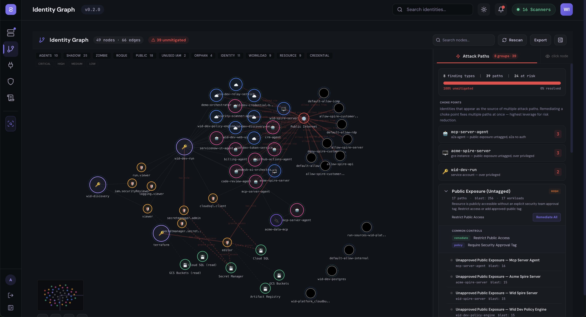
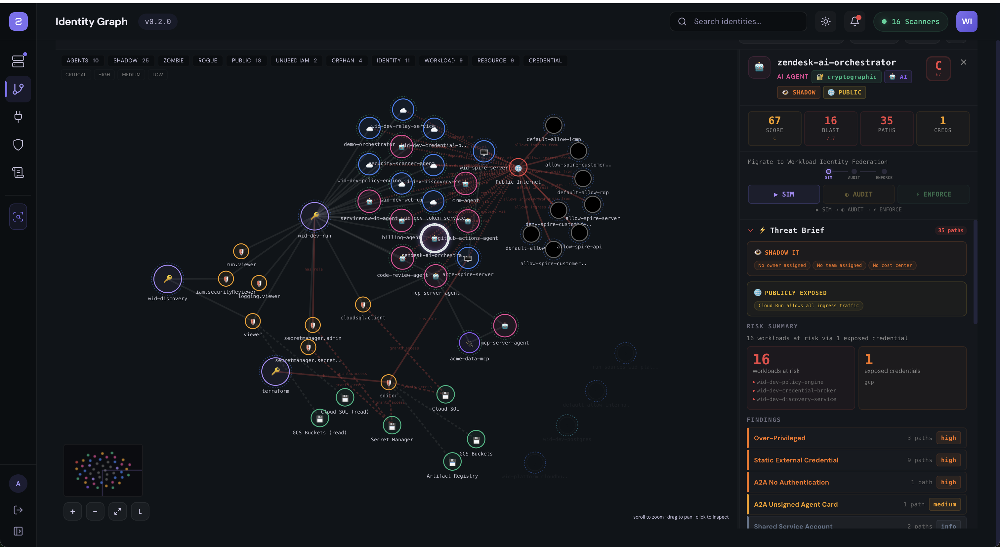
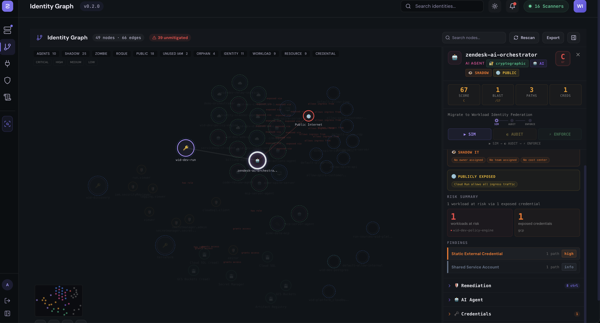
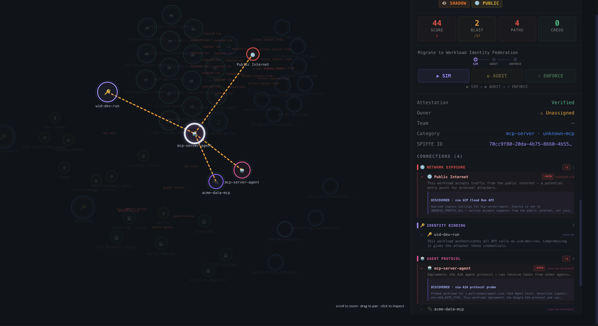

# Workload Identity Director (WID)

**See every non-human identity. Know what it can reach. Enforce least privilege — progressively.**

WID is an enterprise-grade platform for discovering, attesting, and governing non-human identities (NHIs) across multi-cloud and hybrid infrastructure. It builds a live identity graph, scores risk using blast radius analysis, and lets security teams enforce policy progressively — from Simulate to Audit to Enforce — without breaking production.

## Screenshots

| Identity Graph with Attack Paths | Workload Risk Summary |
|:---:|:---:|
|  |  |
| **Node Detail with Policy Modes** | **Connection Analysis** |
|  |  |

## Key Features

- **Multi-Cloud Discovery** — 16 pluggable scanners auto-discover workloads across GCP, AWS, Azure, Kubernetes, Docker, Vault, GitHub CI/CD, and on-prem
- **Identity Graph** — Interactive graph visualization with nodes (workloads, credentials, resources) and edges (bindings, network paths, agent protocols)
- **Attack Path Analysis** — Automated blast radius scoring, credential chain traversal, and public exposure detection
- **Progressive Policy Enforcement** — Per-workload policy modes: **Simulate** (what-if), **Audit** (log decisions, traffic flows), **Enforce** (block/revoke)
- **Chain-Aware Enforcement** — Tracks delegation chains across AI agent hops to prevent confused deputy attacks
- **Deterministic Decision Replay** — Every authorization decision is logged with full context for compliance replay (EU AI Act ready)
- **MCP Server Integrity Scanning** — Detects shadow MCP servers and validates agent protocol configurations
- **Hub-and-Spoke Federation** — Central control plane on GCP Cloud Run; local spokes operate autonomously with cached policies

## Architecture

Hub-and-spoke federated architecture. GCP Cloud Run is the central control plane. Each environment runs a spoke (relay + edge gateways).

```
                    GCP Cloud Run (CENTRAL)
                    +--------------------------+
                    | policy-engine     :3001  |
                    | token-service     :3000  |
                    | credential-broker :3002  |
                    | discovery-service :3003  |
                    | relay (hub)       :3005  |
                    | web-ui            :3100  |
                    | Cloud SQL (Postgres 16)  |
                    +-----+------+-------------+
                          |      |
            policy sync   |      |  audit events
            (pull, 15s)   |      |  (push, 5s batch)
                          |      |
          +---------------+      +----------------+
          |                                       |
+---------v----------+              +-------------v------+
| Local Docker       |              | AWS / Other Spoke  |
| relay (spoke)      |              | relay (spoke)      |
| edge-gateways (7)  |              | edge-gateways      |
+--------------------+              +--------------------+
```

**Design principles:**
- Policy decisions evaluated locally (embedded OPA) — no round-trip to central on the hot path
- Control plane can fail without breaking enforcement (LKG policy bundles)
- Deterministic failure semantics per action type (fail-closed/open/conditional)
- mTLS between services, signed policy bundles, tamper-evident audit logs

## Repository Structure

```
wip/
+-- database/               # Authoritative schema (init.sql v3.0.0)
+-- deploy/
|   +-- gcp/terraform/      # GCP Cloud Run + Cloud SQL + LB
|   +-- aws/terraform/      # AWS EKS + RDS (future spoke)
|   +-- demo-agents/        # Multi-platform agent deployer
+-- services/
|   +-- policy-sync-service/ # Policy engine + auth decisions (port 3001)
|   +-- discovery-service/   # Workload scanner + identity graph (port 3003)
|   +-- token-service/       # JIT token issuance (port 3000)
|   +-- credential-broker/   # Multi-provider secrets (port 3002)
|   +-- relay-service/       # Hub-spoke federation (port 3005)
|   +-- edge-gateway/        # Data plane PEP - sidecar proxy
|   +-- ext-authz-adapter/   # Envoy ext_authz alternative
|   +-- opa/                 # OPA policy (default deny)
+-- shared/
|   +-- data-plane-core/     # Shared: CircuitBreaker, PolicyCache, CredBuffer
+-- web/
    +-- workload-identity-manager/  # React SPA (Vite + Tailwind, port 3100)
```

## Quick Start

### Prerequisites

- Docker Desktop
- Node.js 18+
- GCP account (for central control plane)

### Local Spoke Mode (connects to GCP central)

```bash
# 1. Configure environment
cp .env.example .env
# Edit .env with your CENTRAL_URL and cloud credentials

# 2. Start spoke (relay + edge gateways)
docker compose up --build

# 3. Start demo agents (separate repo)
cd ../wid-demo-agents && docker compose up --build

# 4. Verify
curl http://localhost:3005/health          # spoke relay
curl http://localhost:8001/health          # agent via gateway
```

### Local Fullstack (standalone, all services)

```bash
docker compose -f docker-compose.fullstack.yml up --build
# UI at http://localhost:3100
```

## Scanner Architecture

16 pluggable scanners auto-discovered at startup. Each activates when its credentials are configured:

| Scanner | Provider | Required Credentials |
|---------|----------|---------------------|
| GCPScanner | GCP | `GCP_PROJECT_ID` or Cloud Run auto-detect |
| AWSScanner | AWS | `AWS_ACCESS_KEY_ID`, `AWS_SECRET_ACCESS_KEY` |
| AWSNetworkScanner | AWS | Same as above |
| AWSSecurityScanner | AWS | Same as above |
| AWSStorageScanner | AWS | Same as above |
| IAMScanner | AWS | Same as above |
| AzureScanner | Azure | `AZURE_SUBSCRIPTION_ID`, `AZURE_CLIENT_ID`, `AZURE_TENANT_ID`, `AZURE_CLIENT_SECRET` |
| AzureEntraScanner | Azure | `AZURE_TENANT_ID`, `AZURE_CLIENT_ID`, `AZURE_CLIENT_SECRET` |
| DockerScanner | Docker | Docker daemon running (socket at `/var/run/docker.sock`) |
| KubernetesScanner | K8s | Kubeconfig or in-cluster service account |
| CICDScanner | GitHub | `GITHUB_TOKEN`, `GITHUB_ORG` |
| VaultScanner | Vault | `VAULT_ADDR`, `VAULT_TOKEN` |
| ServiceTokenScanner | Internal | Token service, certs dir, or SPIRE agent |
| OracleScanner | Oracle | Coming soon |
| VMwareScanner | VMware | Coming soon |
| OpenStackScanner | OpenStack | Coming soon |

Check scanner status: `GET /api/v1/scanners`

## Data Plane Modes

Two options per environment (choose one):

| Mode | Use When | Port |
|------|----------|------|
| **Edge Gateway** (default) | No service mesh. VMs, Docker, plain K8s | 15001/15006/15000 |
| **Ext-authz Adapter** | Customer has Istio/Envoy | 9191 (gRPC) / 8080 |

Both connect to the local relay, which connects to GCP central.

## Policy Enforcement Flow

```
Simulate: Projects WOULD_BLOCK decisions locally, no graph change
Audit:    Live decision stream, traffic still flows, amber indicators
Enforce:  Credentials revoked, edges severed, nodes turn green
```

Policies deploy progressively per-workload. Rollback is instant via policy mode switch.

## Key APIs

| Endpoint | Method | Description |
|----------|--------|-------------|
| `/api/v1/graph` | GET | Identity graph with nodes, edges, attack paths |
| `/api/v1/scanners` | GET | All scanner statuses + required credentials |
| `/api/v1/workloads/scan` | POST | Trigger discovery scan |
| `/api/v1/policies` | GET/POST | Policy CRUD |
| `/api/v1/decisions` | GET | Authorization decision log |
| `/api/v1/relay/environments` | GET | Federation status |

## GCP Deployment

```bash
cd deploy/gcp/terraform
cp dev.tfvars.example dev.tfvars  # edit with your project ID
terraform init && terraform plan -var-file=dev.tfvars
terraform apply -var-file=dev.tfvars
```

See [DEPLOYMENT.md](DEPLOYMENT.md) for full deployment guide.

## Related Repositories

| Repo | Description |
|------|-------------|
| `wid-demo-agents` | 7 demo AI agent workloads (ServiceNow, GitHub, Zendesk, etc.) |

## Security

- All adapters start in `audit` mode with `fail-open` behavior
- OPA default deny policy (`services/opa/policies/workload.rego`)
- mTLS between services, least privilege IAM
- Policy bundles versioned + signed with LKG rollback
- Tamper-evident audit logs with deterministic replay

## License

Proprietary. All rights reserved.
