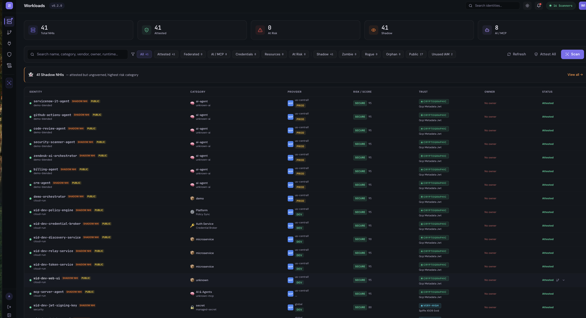
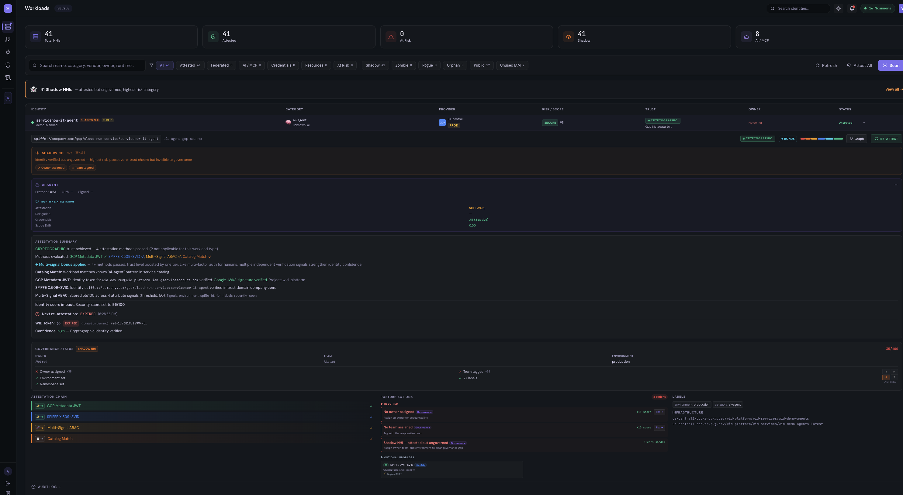
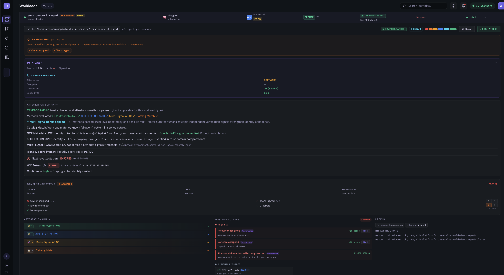

# Workload Identity Director (WID)

**See every non-human identity. Know what it can reach. Enforce least privilege — progressively.**

WID is an enterprise-grade platform for discovering, attesting, and governing non-human identities (NHIs) across multi-cloud and hybrid infrastructure. It builds a live identity graph, scores risk using blast radius analysis, and lets security teams enforce policy progressively — from Simulate to Audit to Enforce — without breaking production.

---

## Screenshots

### Identity Graph with Attack Paths


### Workload Risk Summary


### Node Detail with Policy Modes


### Connection Analysis


### Workload Inventory


### Workload Detail — Attestation & Governance


### Workload Governance — Posture Actions & Attestation Chain


---

## Core Capabilities

### 1. Multi-Cloud Discovery

16 pluggable scanners auto-discover workloads across GCP, AWS, Azure, Kubernetes, Docker, Vault, GitHub CI/CD, and on-prem. Each scanner activates when its credentials are configured — no code changes needed.

Discovered workloads include: Cloud Run services, Lambda functions, EC2 instances, ECS tasks, Kubernetes pods, Docker containers, service accounts, managed identities, IAM roles, AI agents (A2A/MCP), and external API dependencies.

### 2. Identity Graph & Attack Path Analysis

WID builds a live force-directed identity graph with 22 node types and 17+ relationship types. Every edge carries provenance — which API discovered it and what it means operationally.

**Attack path detectors** automatically identify:
- Shared service account abuse (lateral movement)
- Static credential exposure (key leaks)
- Public-to-internal pivot paths
- Privilege escalation chains
- Cross-account trust misconfigurations
- Toxic delegation chains across AI agents
- Shadow AI (undocumented AI API calls)

Each workload gets a **blast radius score** — how many downstream systems are reachable if compromised — and a **risk score** factoring in credential exposure, attestation level, and attack path severity.

### 3. Workload Attestation (4-Tier Trust Model)

WID replaces static credentials with cryptographically verifiable identity. Every workload is attested through a graduated trust hierarchy — higher tiers earn longer token TTLs and access to more sensitive resources:

| Tier | Trust Level | Methods | Token TTL |
|------|-------------|---------|-----------|
| **1 — Cryptographic** | `cryptographic` | SPIRE X.509 SVID, GCP metadata JWT (JWKS-verified), AWS IMDSv2 signed document, Azure MSI signed JWT, mTLS | 1 hour |
| **2 — Token-Based** | `high` | JWT/OIDC verified, GitHub Actions OIDC, Vault token introspection, K8s TokenReview, AWS STS | 30 min |
| **3 — Attribute-Based** | `medium` | Multi-signal ABAC (3+ runtime attributes), container verification (image digest + labels), network verification | 15 min |
| **4 — Policy/Manual** | `low` | Service catalog match, OPA/Rego evaluation, manual operator approval | 5 min |

The attestation engine tries the highest tier first and falls back gracefully. Trust level is reflected visually in the graph (green ring = cryptographic, blue = high, amber = medium, red = unattested) and directly affects policy evaluation.

### 4. JIT WID Tokens

On successful attestation, WID issues short-lived SPIFFE-bound tokens:

```json
{
  "typ": "WID-TOKEN",
  "sub": "spiffe://wid-platform/workload/billing-agent",
  "wid": {
    "trust_level": "cryptographic",
    "attestation_method": "gcp-metadata-jwt",
    "is_ai_agent": true,
    "attestation_chain": [
      { "method": "gcp-metadata-jwt", "trust": "cryptographic", "tier": 1 }
    ]
  }
}
```

Tokens encode attestation method and trust level so downstream policy decisions can gate access based on proof strength. Continuous re-attestation runs automatically before token expiry — compromised workloads are detected when re-attestation fails.

Token chains are tracked via `parent_jti` and `root_jti` for full delegation lineage across On-Behalf-Of (OBO) token exchanges.

### 5. Progressive Policy Enforcement: Simulate → Audit → Enforce

This is WID's core differentiator. Instead of "deploy and pray," security teams roll out controls progressively per workload:

**Simulate** — Zero impact. Policies evaluate but never block traffic. Returns `WOULD_BLOCK` decisions showing exactly what would be denied. No graph changes. Used to preview impact before rollout.

**Audit** — Observe only. All violations are recorded, but traffic is never blocked. Graph edges turn amber dashed with violation badges. Operators see real traffic patterns before committing to enforcement.

**Enforce** — Hard block. Violations block traffic immediately (HTTP 403). Graph updates in real-time: affected edges turn gray/severed, remediated nodes turn green, risk scores drop, attack paths go to zero.

```
simulate → observe WOULD_BLOCK decisions for 24-48 hours
  ↓
audit → enable logging, monitor for false positives
  ↓
enforce (per-workload) → enable blocking for one workload, verify
  ↓
enforce (globally) → roll out to all matching workloads
```

**Rollback is instant** — switch any policy back to audit or simulate with one click. No downtime, no deployment.

| Mode | Edges | Nodes | Score | Attack Paths |
|------|-------|-------|-------|-------------|
| **Simulate** | No change | No change | No change | Shown with `WOULD_BLOCK` |
| **Audit** | Amber dashed | No change | No change | Still counted |
| **Enforce** | Gray dashed + severed | Green ring | Jumps up | Severed → 0 |
| **Rollback** | Restored to solid | Revert to original | Drops back | Reappear |

### 6. Governance & Policy Templates

WID ships with 30+ policy templates across 6 categories:

- **Compliance / Posture** — Block unattested production workloads, flag shadow identities, require owner assignment
- **Lifecycle** — Quarantine stale credentials (90+ days), force rotation, disable credentials older than 365 days
- **Access Control** — Block cross-environment access, require minimum trust level for production, restrict by environment
- **Conditional Access** — Business-hours-only access, geo-restrictions, posture score gating
- **AI Agent** — Scope ceiling enforcement, delegation chain binding, MCP tool restrictions, emergency kill switches
- **Credential Hygiene** — Migrate static keys to Vault, ban hardcoded API keys, enforce JIT credential issuance

Templates are deployed as live policies in one API call:
```
POST /api/v1/policies/from-template/credential-vault-migration
  { "enforcement_mode": "simulate", "workload": "billing-agent" }
```

### 7. Authorization Event Log & Access Decisions

Every policy decision — simulate, audit, or enforce — is persisted with full context:

- **Decision metadata**: verdict (allow/deny), policy name, enforcement action, latency
- **Identity context**: source/destination workload names, SPIFFE IDs, trust levels
- **Chain context**: trace_id, hop_index, total_hops for multi-hop agent chains
- **Token context**: WID token validation result, attestation method
- **Request context**: method, path, headers, identity info

The Authorization Events page provides:
- **Live decision stream** with real-time filtering by workload, verdict, policy, and enforcement mode
- **Trace viewer** — filter by `trace_id` to replay an entire multi-hop agent chain and see which hop was blocked
- **Aggregate stats** — hourly decision rates, top offending workloads, policy hit rates

### 8. AI Agent Chain Tracing

WID traces authorization decisions across multi-hop AI agent chains. When a ServiceNow IT agent calls a code-review agent, which calls OpenAI, which triggers a billing check against Stripe — every hop is traced:

```
Hop 0: servicenow-it-agent → code-review-agent   trace-abc, hop 0/3
Hop 1: code-review-agent → OpenAI API             trace-abc, hop 1/3
Hop 2: servicenow-it-agent → billing-agent         trace-abc, hop 2/3
Hop 3: billing-agent → Stripe API                  trace-abc, hop 3/3
```

All hops share a single `trace_id`. The chain is fully queryable — identify which hop was blocked, which agent escalated privilege, and whether the delegation chain was authorized.

### 9. Deterministic Decision Replay

Every authorization decision is logged with enough context to reconstruct it exactly. This enables:

- **Compliance audits** — replay any decision and prove why access was granted or denied
- **Incident investigation** — trace back from a breach to the exact policy evaluation that allowed it
- **EU AI Act readiness** (Aug 2026) — full decision chain documentation for AI agent authorization

The replay chain links: attestation evidence → WID token → policy evaluation → verdict → enforcement action.

### 10. MCP Server Integrity Scanning

WID detects Model Context Protocol (MCP) servers in your infrastructure:
- Discovers MCP endpoints via protocol probing
- Validates agent-to-server configurations
- Flags shadow MCP servers (undocumented, no owner)
- Enforces tool whitelists (block dangerous tools: shell, exec, delete)

---

## Architecture

Hub-and-spoke federated architecture. GCP Cloud Run is the central control plane. Each environment runs a spoke (relay + edge gateways).

```
                    GCP Cloud Run (CENTRAL)
                    +--------------------------+
                    | policy-engine     :3001  |
                    | token-service     :3000  |
                    | credential-broker :3002  |
                    | discovery-service :3003  |
                    | relay (hub)       :3005  |
                    | web-ui            :3100  |
                    | Cloud SQL (Postgres 16)  |
                    +-----+------+-------------+
                          |      |
            policy sync   |      |  audit events
            (pull, 15s)   |      |  (push, 5s batch)
                          |      |
          +---------------+      +----------------+
          |                                       |
+---------v----------+              +-------------v------+
| Local Docker       |              | AWS / Other Spoke  |
| relay (spoke)      |              | relay (spoke)      |
| edge-gateways (7)  |              | edge-gateways      |
+--------------------+              +--------------------+
```

**Design principles:**
- **Policy decisions evaluated locally** — embedded OPA engine, no round-trip to central on the hot path (~12-17ms total latency)
- **Control plane can fail without breaking enforcement** — spokes operate on cached, signed policy bundles (LKG)
- **No infrastructure prerequisites** — edge gateway works without service mesh, Istio, or Envoy
- **Deterministic failure semantics** — configurable per-action: fail-open (default), fail-closed, fail-conditional
- **mTLS between services**, signed policy bundles, tamper-evident audit logs

### Data Plane Modes

Two options per environment (choose one):

| Mode | Use When | Port |
|------|----------|------|
| **Edge Gateway** (default) | No service mesh. VMs, Docker, plain K8s | 15001/15006/15000 |
| **Ext-authz Adapter** | Customer has Istio/Envoy | 9191 (gRPC) / 8080 |

Both connect to the local relay, which connects to GCP central.

---

## Repository Structure

```
wip/
+-- database/               # Authoritative schema (init.sql v3.0.0)
+-- deploy/
|   +-- gcp/terraform/      # GCP Cloud Run + Cloud SQL + LB
|   +-- aws/terraform/      # AWS EKS + RDS (future spoke)
|   +-- demo-agents/        # Multi-platform agent deployer
+-- services/
|   +-- policy-sync-service/ # Policy engine + auth decisions (port 3001)
|   +-- discovery-service/   # Workload scanner + identity graph (port 3003)
|   +-- token-service/       # JIT token issuance + chain tracking (port 3000)
|   +-- credential-broker/   # Multi-provider secrets (port 3002)
|   +-- relay-service/       # Hub-spoke federation (port 3005)
|   +-- edge-gateway/        # Data plane PEP - sidecar proxy
|   +-- ext-authz-adapter/   # Envoy ext_authz alternative
|   +-- opa/                 # OPA policy (default deny)
+-- shared/
|   +-- data-plane-core/     # Shared: CircuitBreaker, PolicyCache, CredBuffer
+-- web/
    +-- workload-identity-manager/  # React SPA (Vite + Tailwind, port 3100)
```

---

## Quick Start

### Prerequisites

- Docker Desktop
- Node.js 18+
- GCP account (for central control plane)

### Local Spoke Mode (connects to GCP central)

```bash
# 1. Configure environment
cp .env.example .env
# Edit .env with your CENTRAL_URL and cloud credentials

# 2. Start spoke (relay + edge gateways)
docker compose up --build

# 3. Start demo agents (separate repo)
cd ../wid-demo-agents && docker compose up --build

# 4. Verify
curl http://localhost:3005/health          # spoke relay
curl http://localhost:8001/health          # agent via gateway
```

### Local Fullstack (standalone, all services)

```bash
docker compose -f docker-compose.fullstack.yml up --build
# UI at http://localhost:3100
```

---

## Scanner Architecture

16 pluggable scanners auto-discovered at startup. Each activates when its credentials are configured:

| Scanner | Provider | Required Credentials |
|---------|----------|---------------------|
| GCPScanner | GCP | `GCP_PROJECT_ID` or Cloud Run auto-detect |
| AWSScanner | AWS | `AWS_ACCESS_KEY_ID`, `AWS_SECRET_ACCESS_KEY` |
| AWSNetworkScanner | AWS | Same as above |
| AWSSecurityScanner | AWS | Same as above |
| AWSStorageScanner | AWS | Same as above |
| IAMScanner | AWS | Same as above |
| AzureScanner | Azure | `AZURE_SUBSCRIPTION_ID`, `AZURE_CLIENT_ID`, `AZURE_TENANT_ID`, `AZURE_CLIENT_SECRET` |
| AzureEntraScanner | Azure | `AZURE_TENANT_ID`, `AZURE_CLIENT_ID`, `AZURE_CLIENT_SECRET` |
| DockerScanner | Docker | Docker daemon running (socket at `/var/run/docker.sock`) |
| KubernetesScanner | K8s | Kubeconfig or in-cluster service account |
| CICDScanner | GitHub | `GITHUB_TOKEN`, `GITHUB_ORG` |
| VaultScanner | Vault | `VAULT_ADDR`, `VAULT_TOKEN` |
| ServiceTokenScanner | Internal | Token service, certs dir, or SPIRE agent |
| OracleScanner | Oracle | Coming soon |
| VMwareScanner | VMware | Coming soon |
| OpenStackScanner | OpenStack | Coming soon |

Check scanner status: `GET /api/v1/scanners`

---

## Key APIs

| Endpoint | Method | Description |
|----------|--------|-------------|
| `/api/v1/graph` | GET | Identity graph with nodes, edges, attack paths |
| `/api/v1/workloads/scan` | POST | Trigger discovery scan |
| `/api/v1/scanners` | GET | All scanner statuses + required credentials |
| `/api/v1/policies` | GET/POST | Policy CRUD |
| `/api/v1/policies/from-template/:id` | POST | Deploy policy from template |
| `/api/v1/gateway/evaluate` | POST | Hot-path: evaluate request against policies |
| `/api/v1/gateway/evaluate-chain` | POST | Multi-hop chain evaluation |
| `/api/v1/access/decisions/live` | GET | Live authorization decision stream |
| `/api/v1/access/decisions/traces/:traceId` | GET | Full trace chain replay |
| `/api/v1/access/decisions/stats` | GET | Aggregate decision stats |
| `/api/v1/relay/environments` | GET | Federation status |

---

## GCP Deployment

```bash
cd deploy/gcp/terraform
cp dev.tfvars.example dev.tfvars  # edit with your project ID
terraform init && terraform plan -var-file=dev.tfvars
terraform apply -var-file=dev.tfvars
```

See [DEPLOYMENT.md](DEPLOYMENT.md) for full deployment guide.

---

## Related Repositories

| Repo | Description |
|------|-------------|
| `wid-demo-agents` | 7 demo AI agent workloads (ServiceNow, GitHub, Zendesk, etc.) |

---

## Security

- All adapters start in `audit` mode with `fail-open` behavior — safe by default
- OPA default deny policy (`services/opa/policies/workload.rego`)
- mTLS between services, least privilege IAM
- Policy bundles versioned + signed with LKG rollback
- Tamper-evident audit logs with deterministic replay
- Continuous re-attestation with automatic token rotation
- Zero-trust default: unregistered workloads are denied, invalid tokens rejected

---

## License

Proprietary. All rights reserved.
